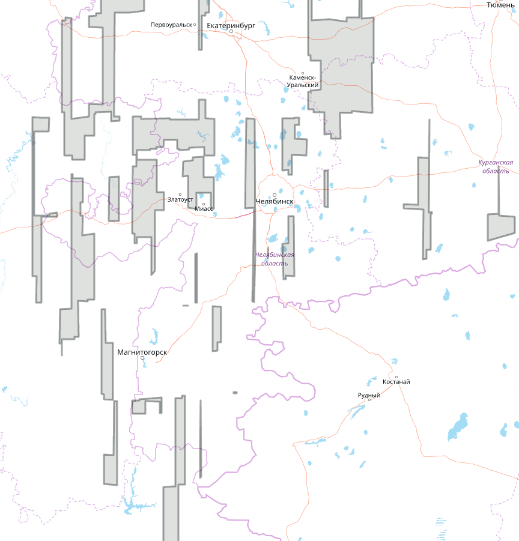

# osm-imagery-chelyabinsk

Borders of high resolution imagery available in [OpenStreetMap](http://osm.org) for Chelyabinsk oblast, Russia. Unavailable areas marked with gray.

# The same in Russian

Границы спутниковых снимков высокого разрешения, доступных для обрисовки в [OpenStreetMap](http://osm.org) на территории Челябинской области и рядом с ней.

# Схемы покрытия

Области, где нет снимков, помечены серым.

## Bing

